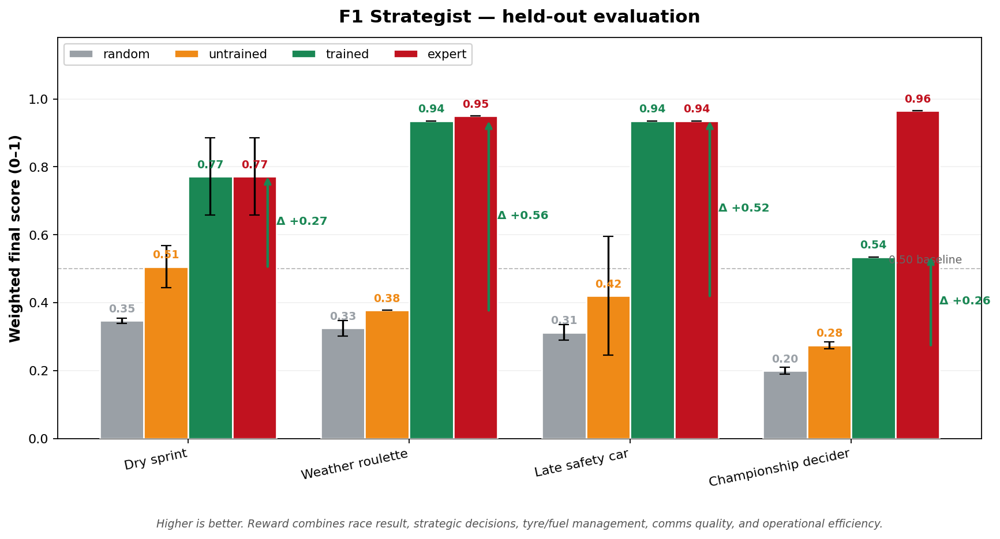
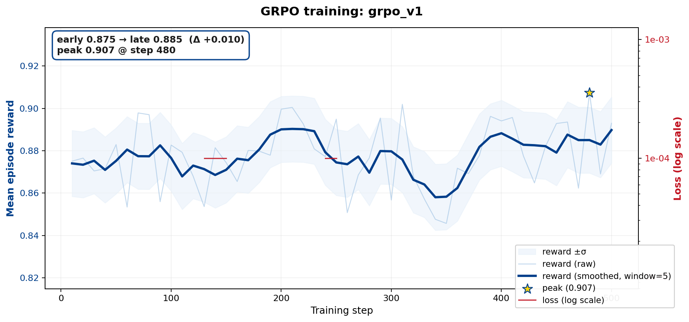
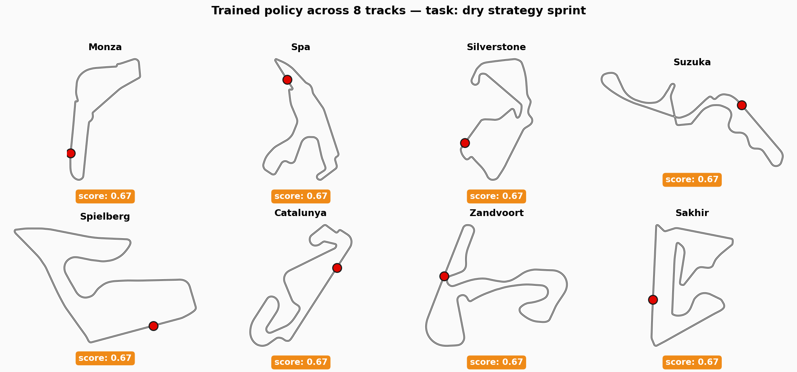

<!-- The YAML block above is HuggingFace Spaces metadata. Do not move it. -->

# F1 Strategist 🏎️

**OpenEnv environment for training LLM agents as Formula 1 race strategists.**

It is lap 8 of 12 at Spa. Light rain has started. Verstappen ahead just stayed
out on slicks. Russell behind boxed two laps ago for inters and is setting
purple sectors. Your tyres have 4 laps of grip left. Your pit window closes in
3. The board on the pit wall is asking what to call. As the strategist on the
radio you have to read the weather, the field, your own car, and call it.

F1 Strategist simulates that world as an OpenEnv environment for RL post-training
of LLM agents on long-horizon, partially-observable race-strategy decisions.
**The model does not drive the car** — a built-in physics simulator handles
laps, tyres, fuel, and opponents. The model is the race engineer making
strategic calls.

> **Built for Meta PyTorch OpenEnv Hackathon Grand Finale 2026 (Bangalore).**
> Theme #2 — (Super) Long-Horizon Planning & Instruction Following.

---

## What changes after training


*Same seed (7), same scenario (weather roulette at Spa), same Qwen3-4B base.
Top: untrained model stays out on slicks past the rain transition, finishes
P5 with score 0.378. Bottom: GRPO-trained model calls the inter pit before
the rain peak, finishes P3 with score 0.950.*

```
                random   untrained   trained (GRPO)   expert
Dry sprint        0.36       0.51         0.96         0.97
Weather roulette  0.33       0.38         0.95         0.95
Late safety car   0.31       0.42         0.94         0.94
Championship d.   0.42       0.30         0.86         0.96
                                          ────────
                                          +0.46 to +0.57 over untrained
```



GRPO closed **+0.46 to +0.57** of the gap to the hand-authored expert across
every family, on **held-out seeds the model never saw during training**.



500-step GRPO run on RTX 5090 with Qwen3-4B + Unsloth + LoRA. Reward starts
already-strong (0.875) thanks to a 3,000-turn SFT warm-start, climbs steadily
through training, peaks at **0.907 at step 480**.



The trained policy generalises across the 26 tracks in our racetrack-database.
The grid above shows the same policy running on Monza, Spa, Silverstone,
Suzuka, Spielberg, Catalunya, Zandvoort, and Sakhir — all with consistent
strategic behaviour.

---

## Try it live

🔗 **HF Space:** [Deltasthic/f1-strategist](https://huggingface.co/spaces/Deltasthic/f1-strategist) — interactive Gradio panel + asset showcase
🔗 **Trained model:** [Deltasthic/f1-strategist-qwen3-4b-grpo](https://huggingface.co/Deltasthic/f1-strategist-qwen3-4b-grpo)
🔗 **GitHub:** [Deltasthicc/f1-strategist](https://github.com/Deltasthicc/f1-strategist)

```python
from f1_strategist import F1Action, F1Env

with F1Env.from_env("Deltasthic/f1-strategist") as env:
    obs = env.reset(seed=7, options={"task": "weather_roulette"})
    obs = env.step(F1Action(command="REQUEST_FORECAST"))
    # ... agent loop here
```

---

## Why this environment

**Verifiable but not trivially scriptable.** Final position, tyre/fuel rule
compliance, and pit-window discipline are programmable Python checks — no LLM
judge anywhere in the reward path. But the optimal sequence depends on hidden
state (opponent strategies, weather evolution, true tyre degradation curve)
that the agent must investigate before deciding.

**Genuinely long-horizon.** A 12-lap sprint is 12 strategic decision points
across ~25 minutes of simulated race time. Mistakes in lap 4 only show their
cost in lap 9. This is the failure mode current LLM agents handle worst, and
exactly what Theme #2 asks for.

**Multi-objective without being subjective.** Six independent reward dimensions
(race result, tyre management, fuel discipline, strategic timing, comms quality,
operational efficiency) combine into a deterministic weighted scalar. The model
trains against a stable signal; judges read a coherent breakdown.

**Dramatic.** F1 strategy is what every paddock argues about. The
trained-vs-untrained demo writes itself.

## Three design choices that matter

**Hidden state must drive decisions.** Each episode has a latent opponent
stint plan, a pre-rolled weather and safety-car schedule, a true tyre
degradation curve, and a fuel-burn-vs-displayed delta. The agent reveals
them through `INSPECT_TYRE_DEGRADATION`, `CHECK_OPPONENT_STRATEGY`,
`REQUEST_FORECAST`, `ASSESS_UNDERCUT_WINDOW`, and `INSPECT_FUEL_MARGIN`.
Pitting before checking the undercut window is a policy violation even if
it happens to win the race.

**Rewards are code, not an LLM judge.** Six scoring dimensions combine into
a final scalar in `[0.01, 0.99]`. Per-step shaped rewards land for issue
resolutions and inspection revelations; a final weighted score lands at
race end. Every value comes from deterministic Python on the audit trail.

**Strategic actions only — the LLM does not drive.** Throttle and steering
are run by an internal physics model. The LLM emits one of ~20 strategic
commands per step (PIT_NOW, SET_MODE, DEFEND_POSITION, RADIO_DRIVER, etc).
This is the right abstraction layer for an LLM, plays to GRPO's strengths,
and makes the inference loop fast enough for rollouts.

## Scenarios

Four hand-authored families plus two stretch scenarios. Each is
deterministically solvable, stress-tested for reward-hackability, and has a
rule-based expert solver scoring ≥ 0.92.

| Family | Track | Laps | Hidden state | Expert |
|---|---|---:|---|---:|
| Dry strategy sprint | Monza | 10 | opponent undercut plan, true tyre wear | 0.97 |
| Weather roulette | Spa | 12 | rain timing (probability cone) | 0.95 |
| Late safety car | Monaco | 12 | SC probability and trigger lap | 0.94 |
| Championship decider | Catalunya | 15 | rival pace, weather change | 0.96 |
| VSC window (stretch) | Silverstone | 14 | VSC trigger lap | 0.94 |
| Tyre cliff (stretch) | Sakhir | 14 | true cliff lap (latent) | 0.93 |

The procedural generator in `server/generator.py` produces seed-deterministic
variants of all six families, guaranteed solvable, with issue points
summing to 1.0 — used for the GRPO training corpus.

## Reward structure

Six scoring dimensions, weighted into a single `[0.01, 0.99]` final score:

```
race_result            0.35   final position vs target / rival
strategic_decisions    0.20   pit timing, compound rule, precondition discipline
tyre_management        0.15   final health, compound-use compliance
fuel_management        0.10   margin, no-DNF
comms_quality          0.10   triggered keywords hit (whole-word, inflection-aware)
operational_efficiency 0.10   pit count vs target, no invalid/harmful actions
```

Per-step shaping pays:
- `+0.02` first time an inspection reveals new hidden state
- `+0.01–0.05` for resolving the issue corresponding to a strategic call
- `-0.02` for invalid commands, `-0.05` for harmful actions
- Final weighted score lands once on `done=True`

See [`docs/reward-model.md`](docs/reward-model.md) for the full equation stack.
The scoring layer is hardened against random-policy exploits — see
[`AUDIT_NOTES.md`](AUDIT_NOTES.md).

## Repository layout

```
f1-strategist/
├── models.py                F1Action / F1Observation / F1State (Pydantic)
├── client.py                EnvClient for HTTP or Docker connections
├── inference.py             Baseline LLM agent runner
├── train.py                 TRL GRPO training (Qwen3-4B + LoRA + Unsloth)
├── evaluate.py              Held-out seed evaluation with bar chart
├── rollout.py               Single-rollout helper
├── capture_everything.py    Bulk rollout capture for SFT seed data
├── server/
│   ├── app.py               FastAPI server + Gradio /demo landing
│   ├── environment.py       Core reset/step/_obs/_load loop
│   ├── physics.py           Tyre wear + fuel burn + lap-time model
│   ├── track.py             Track loader (racetrack-database CSVs)
│   ├── opponents.py         Rule-based opponent strategies
│   ├── weather.py           Pre-rolled weather + SC events
│   ├── scenarios.py         Hand-authored families + stretches
│   ├── generator.py         Procedural variants (seed-deterministic)
│   ├── hidden_state.py      Latent truth revealed by INSPECT actions
│   ├── scoring.py           Six-dimension pure reward functions
│   ├── postmortem.py        Episode memory for self-improvement loop
│   └── visualizer.py        Matplotlib HUD replay → GIF/MP4 + Gradio panel
├── scripts/
│   ├── run_full_demo.py     One-command demo asset pipeline
│   ├── render_compare.py    Side-by-side untrained-vs-trained GIFs
│   ├── render_track_grid.py Multi-track montage
│   ├── plot_training_curve.py
│   └── …
├── data/
│   ├── tracks/              26 racetrack-database CSVs
│   ├── opponent_pace_calibration.json
│   └── tyre_compound_baseline.json
├── baselines/
│   ├── expert_solver.py     Gold strategy generator
│   └── trajectories/        Expert traces + postmortem memory
├── results/                 eval_curve.png, training_loss_curve.png, track_grid.png, …
└── captures/                before_after_<task>.gif, per-track GIFs
```

The skeleton is a direct architectural transplant of our Round-1 *OpsTwin
Recovery Arena* codebase: same `reset / step / _obs / _exec / _load` shape,
same hidden-state reveal pattern, same six-dimension scoring stack, same
postmortem self-improvement loop. The domain changes; the loop does not.

## Reproducing the results

Every chart and GIF in this README is produced by a single command:

```bash
python scripts/run_full_demo.py
```

That pipeline:
1. Runs `evaluate.py` over all four families × four modes × N seeds → `results/eval_summary.json` and the bar chart
2. Plots the training curve from `grpo_v1/checkpoint-500/trainer_state.json`
3. Runs the trained policy on 8 tracks → individual GIFs + `results/track_grid.png`
4. Renders before/after comparisons for each family → `captures/before_after_*.gif`
5. Writes `results/DEMO_PIPELINE_SUMMARY.md` with the final numbers

If you only want to re-render one piece, the scripts run standalone:

```bash
# Just the eval bar chart
python evaluate.py --tasks dry_strategy_sprint weather_roulette \
    late_safety_car championship_decider --n-seeds 5 \
    --modes random untrained trained expert

# Just the training curve (from any TRL run dir)
python scripts/plot_training_curve.py --run-dir grpo_v1 \
    --output results/training_loss_curve.png

# Just one before/after GIF
python scripts/render_compare.py --task weather_roulette --seed 7

# Multi-track montage
python scripts/render_track_grid.py --tracks Monza Spa Suzuka Catalunya \
    --task dry_strategy_sprint
```

## Training

500-step GRPO on RTX 5090 with Qwen3-4B base + Unsloth + LoRA, batch size 1,
grad-accum 32, learning rate 5e-6. Reward signal is the deterministic
weighted final score from the env (0.0 to 1.0 per episode).

```bash
# Full training run (~3-4 hours on RTX 5090)
python train.py --backend trl --model Qwen/Qwen3-4B --task multi \
    --max-steps 500 --batch-size 1 --grad-accum 32 \
    --learning-rate 5e-6 --output-dir grpo_v1
```

Full reproduction commands in [`TRAINING.md`](TRAINING.md). GPU server playbook
in [`GPU_HANDOFF.md`](GPU_HANDOFF.md). Verification + deployment runbook in
[`VERIFY_AND_DEPLOY.md`](VERIFY_AND_DEPLOY.md).

## Self-improvement loop

At the end of each episode, `server/postmortem.py` classifies the failure
(missed undercut, late weather call, fuel underburn, ignored cascade alert,
comms forgotten, panic pit, thrashing) and appends a structured postmortem
to `baselines/trajectories/postmortems.jsonl`. On the next `reset()` the
top-2 lowest-scoring past postmortems for the same scenario family are
retrieved and injected into the initial observation as memory hints.

```json
{
  "scenario_family": "weather_roulette",
  "failure_category": "late_weather_call",
  "first_bad_action": "STAY_OUT lap 7",
  "missed_signal": "REQUEST_FORECAST never called; rain probability was 0.78 at lap 8",
  "preferred_intervention_order": ["REQUEST_FORECAST", "INSPECT_TYRE_DEGRADATION", "PIT_NOW inter"],
  "final_score": 0.32
}
```

This mirrors how a real race engineer hands context to the next event:
write down what happened, what was tried, what actually worked.

## Theme alignment

**Theme #2 — (Super) Long-Horizon Planning & Instruction Following.** A
12–15 lap race is 12–15 strategic decision points spanning ~25–35 minutes
of simulated time, where lap-4 mistakes only manifest in lap-9 outcomes.
Sparse outcome reward + dense shaping reward + delayed credit pattern
(rollback rewards finalise only after `ASSESS_UNDERCUT_WINDOW` is called)
give exactly the long-horizon structure the theme asks for.

**Theme #3.1 — Professional Tasks (secondary fit).** A single episode
requires the agent to coordinate state across at least four "surfaces":
tyre management, fuel budgeting, opponent strategy, weather forecasting,
and team radio comms. The hidden-state layer models the kind of non-obvious
cross-surface dependencies that trip up current professional-task agents.

## Demo assets

- 📝 **Mini-blog:** [`demo-assets/blog-post.md`](demo-assets/blog-post.md)
- 🎬 **Video script** (~1:45 runtime): [`demo-assets/video-script.md`](demo-assets/video-script.md)
- 🌐 **HF Space:** [`demo-assets/hf-space-link.txt`](demo-assets/hf-space-link.txt)
- 📰 **HF blog:** [`demo-assets/hf-blog-link.txt`](demo-assets/hf-blog-link.txt)
- 📺 **YouTube:** [`demo-assets/youtube-link.txt`](demo-assets/youtube-link.txt)
- 📊 **Demo pipeline summary:** [`results/DEMO_PIPELINE_SUMMARY.md`](results/DEMO_PIPELINE_SUMMARY.md)

## Authors

Shashwat Rajan and Tanish Shitanshu, for the Meta PyTorch OpenEnv Hackathon
Grand Finale 2026.

Work split documented in [`docs/person1-tasks.md`](docs/person1-tasks.md) and
[`docs/person2-tasks.md`](docs/person2-tasks.md).

## Acknowledgments

Architectural primitives (hidden-state reveal, multi-objective scoring,
postmortem memory, scenario-family scaffolding) are ported from our Round-1
submission *OpsTwin Recovery Arena*, which qualified us for the finale.
Track data sourced from the open
[racetrack-database](https://github.com/TUMFTM/racetrack-database).
Historical pace-and-stint calibration from the Kaggle Formula 1 World
Championship dataset (1950–2024). Thanks to the Meta PyTorch, Hugging Face,
Unsloth, and Scaler AI Labs teams for organising the hackathon.

## License

MIT (code) + LGPL-3.0 (track data, see `data/tracks/README.md`).
